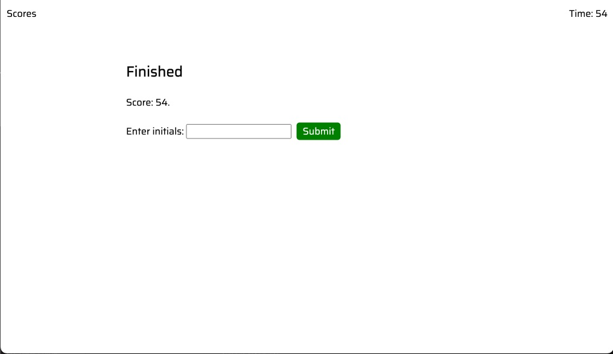

# quiz-code-codypolland
## Description

My main focus of this project was to expand my knowledge of Web APIS. I wanted to secure my fondation knowledge of the DOM, setting attributes, creating and apending elements, time intervals, event listeners, and local sotrage. 
I wanted something that I could plug and question in the JavaScript and test my knowledge to further my learning. I too it to the next level and added some custom CSS and fonts to make look polished. 
## Installation

This project has been deployed to GitHub Pages. To get this project up and running, you can follow the deployment link. Or, download the sources files to use this as a template in VS Code. 

Github deployed IO link
- [GitHub Pages](https://cpolland.github.io/quiz-code-codypolland/)

## Usage
The intial landing state of the Page with scores, timer, quiz description,begin button. 

Once you click the Begin Quiz button the quiz directs you to the first question page.

Once you finish the quiz you are directed to the results page. 

in the upper right you can check your scores saved in local storage. 

## Credits

This was a solo project worked on by Cody Polland.

## Badges

